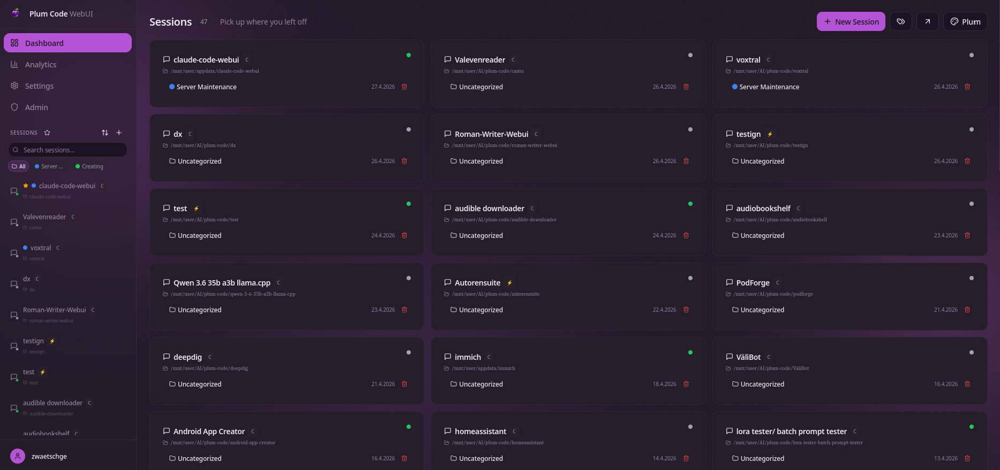
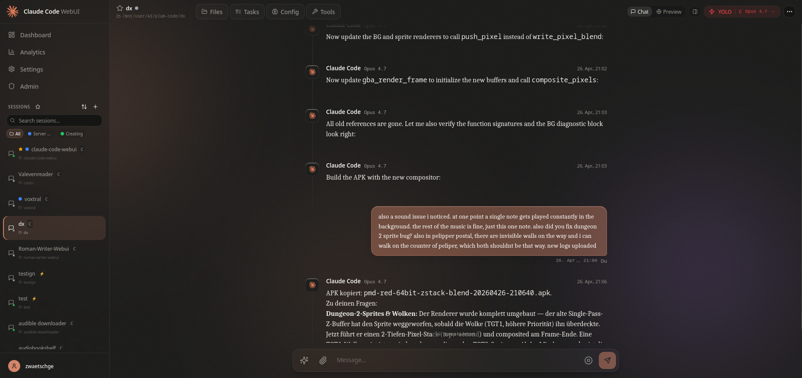
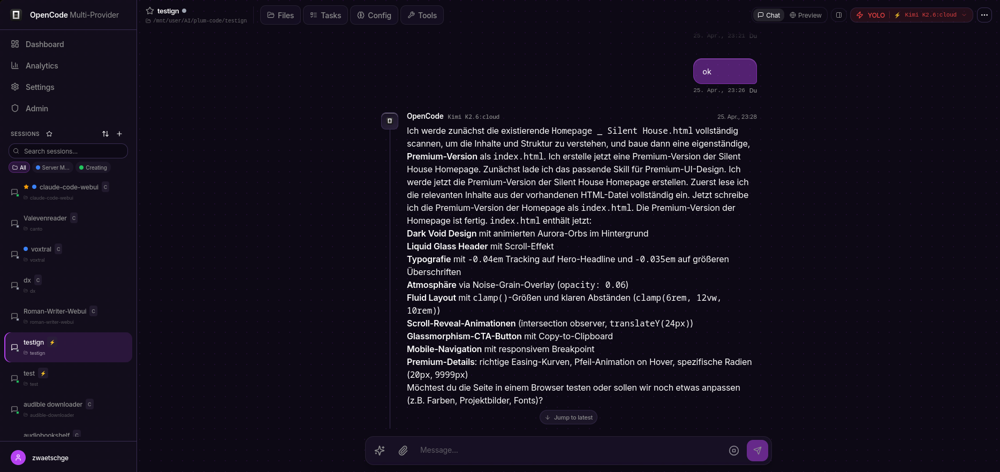
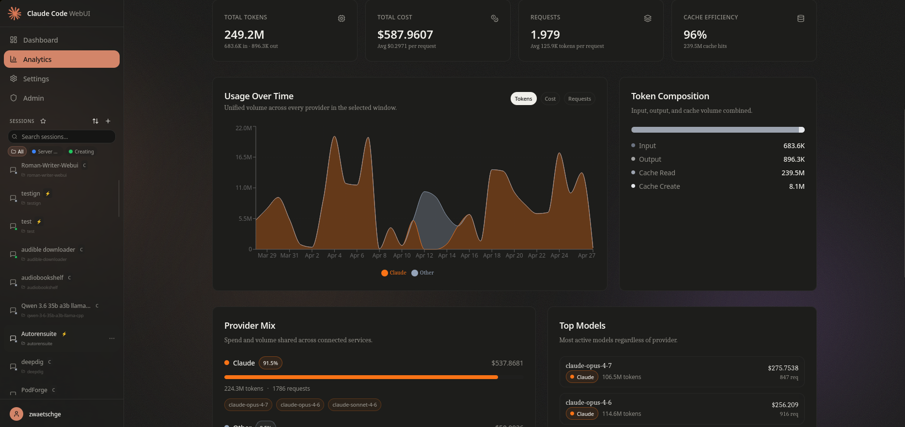
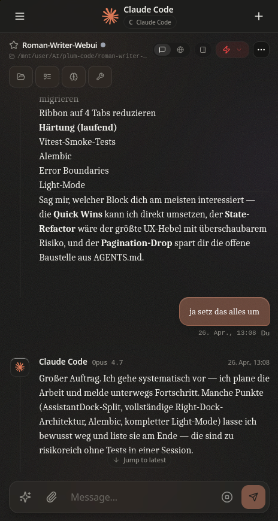

# Plum Code WebUI

A powerful web-based interface for Claude Code, Codex, Gemini, and GLM CLIs with multi-provider support, real-time streaming, tool execution tracking, orchestration, and self-rebuild capabilities.

[](LICENSE)
[](https://www.typescriptlang.org/)
[](https://react.dev/)
[](https://hub.docker.com/r/valentin2177/claude-code-webui)

# Screenshots

## Desktop


*Sessions dashboard — pick up where you left off across providers and projects.*


*Live chat session driving the Claude Code CLI with streaming responses, tool execution, and inline preview.*


*OpenCode session running Kimi K2.6 — 75+ LLMs available behind a single CLI.*


*Analytics — token volume, cost, request count, cache efficiency, and per-model breakdown.*

## Mobile



*Responsive chat with the same provider-aware UI on phone-sized viewports.*


## Features

### Chat Interface
- Real-time streaming responses via WebSocket
- Multi-session management with history
- Image attachments and Gemini image generation
- LaTeX/Math rendering with KaTeX
- Interactive choice prompts
- Context & token popover with live progress bar
- Todo tracking from Claude's TodoWrite tool

### DevTools Integration
- **Context Popover**: Inline progress bar showing context window usage (green→yellow→red), click to see full token breakdown (input/output/cache read/cache write), cost, and model
- **Tool-Log Panel**: Full tool execution timeline with filter buttons (All, Read, Write, Bash, Web, Agent), duration tracking per tool, live timers for running tools, expandable input/output details
- **Compaction Boundary Cards**: Visual separators in chat when context is compacted, with expandable summary text

### Multi-Provider Support
- **Claude** (Anthropic) — primary provider
- **Codex** (OpenAI) — alternative provider
- **GLM** (Z.AI) — Chinese market provider
- Per-session provider selection
- Independent CLI instances per provider

### Orchestration
- Multi-provider task delegation
- Parallel worker execution
- Task routing and progress tracking
- Worker output streaming

### Ralph (Autonomous Loop)
- Iterative autonomous task execution
- Plan generation and progress tracking
- Multi-iteration workflows with checkpoints

### File Management
- File Tree Browser with lazy loading and git status
- Monaco Code Editor with syntax highlighting
- Create, edit, delete, and rename files
- Three view modes: Simple, Compact, Detailed

### Git Integration
- Full Git Panel (staging, commits, diffs, history)
- Visual branch management (create, publish, delete)
- Commit history with diff viewer
- AI-powered commit message generation
- Pull/Fetch with remote status (ahead/behind)

### GitHub Integration
- Create new repositories
- Clone repositories (with repo browser)
- Push to GitHub with remote management
- Token-authenticated operations

### Custom Commands
- Built-in commands: `/help`, `/clear`, `/model`, `/status`, `/cost`, `/compact`
- User commands from `~/.claude/commands/*.md`
- Project commands from `{project}/.claude/commands/*.md`
- Autocomplete dropdown when typing `/`

### Project Management
- Project Auto-Discovery from `~/.claude/projects`
- Working directory navigation
- Session starring and filtering
- PTY Reconnect with 30-minute buffer

### Self-Rebuild
- Container can rebuild and redeploy itself
- Rebuild Robot for external container management
- Status tracking and reporting

### Watchdog & Monitoring
- Session health monitoring
- Telegram bot notifications
- Configurable alert thresholds

### Mobile Support
- Progressive Web App (PWA)
- Bottom tab navigation
- Swipe gestures for panel navigation
- Responsive design

### Settings
- Tabbed settings interface
- Theme configuration
- API key management (Gemini, GitHub)
- MCP Server management with connection testing
- Memory viewer for session context

## Tech Stack

### Backend
- **Express.js** - HTTP server
- **Socket.IO** - Real-time communication
- **SQLite** (better-sqlite3) - Database
- **node-pty** - Claude CLI process management
- **simple-git** - Git operations
- **@octokit/rest** - GitHub API

### Frontend
- **React 18** - UI framework
- **Vite** - Build tool with code splitting
- **Radix UI** - Accessible components
- **Tailwind CSS** - Styling
- **Zustand** - State management
- **TanStack Query** - Data fetching
- **Monaco Editor** - Code editing
- **KaTeX** - Math rendering

### Shared
- **TypeScript** - Type safety across all packages

## Installation

### Quick start (Docker)

```bash
git clone https://github.com/zwaetschge/plum-code-webui.git
cd plum-code-webui
./scripts/install.sh
```

The installer walks you through:
1. **Prereq check** — docker, docker compose plugin, openssl, daemon connectivity.
2. **Interactive `.env`** — public URL, port, allowlisted login emails, host paths for data/config/workspace. Auto-generates `SESSION_SECRET` + `JWT_SECRET`.
3. **`docker compose build` + `up -d`** — first run takes a few minutes.
4. **Health wait** — polls `/health` (or the container's healthcheck) for up to 2 min.
5. **Optional `claude /login`** — drops you into the in-container Claude TUI so you can run `/login` and link an Anthropic account immediately. Can be skipped with `--skip-login`.

Re-run any time to reconfigure (existing `.env` values are preserved unless you pass `--reset`). Non-interactive mode (`--non-interactive`) takes all defaults — useful for CI bootstraps.

**Requirements:** Docker 24+, Docker Compose plugin, openssl. The container ships its own Node + the `claude`, `codex`, and `opencode` CLIs.

### Site-specific deployment (Traefik, Unraid, etc.)

The repo's `docker-compose.yml` is intentionally portable — no Traefik labels, no absolute paths, no external networks. Site-specific overrides go into `docker-compose.override.yml` (gitignored), which Compose auto-merges. A copy-paste starting point lives at `docker-compose.override.yml.example` and shows how to add Traefik labels, absolute host paths (e.g. `/mnt/user/appdata/...` on Unraid), `group_add` for the docker socket GID, and a repair-bot self-rebuild sidecar.

### Manual Docker (no installer)

```bash
cp .env.example .env       # then edit: SESSION_SECRET, JWT_SECRET, AUTH_ALLOWED_EMAILS, FRONTEND_URL
docker compose up -d --build
```

Access the WebUI at the `FRONTEND_URL` you configured (default `http://localhost:4545`).

### Development setup (no Docker)

```bash
pnpm install                # workspace deps
pnpm dev                    # backend (3006) + frontend (5173) in parallel
# or:
./scripts/start-webui.sh    # generates ephemeral secrets, kills stale PIDs, tails logs
```

Prerequisites: Node 20+, pnpm 9+, the `claude` CLI installed locally if you want OAuth-linked sessions.

### Production build (no Docker)

```bash
pnpm build
pnpm start
```

## Configuration

### Environment Variables

Full schema in `packages/backend/src/config.ts` (zod-validated, fails fast on startup). Most setups can ignore everything below the divider — `scripts/install.sh` writes the required values into `.env` for you.

| Variable | Description | Required |
|----------|-------------|----------|
| `SESSION_SECRET` | Express session secret (min 32 chars). Installer auto-generates. | Yes |
| `JWT_SECRET` | JWT signing key (min 32 chars). Installer auto-generates. | Yes |
| `AUTH_ALLOWED_EMAILS` | Comma-separated email allowlist enforced for both OAuth and basic-auth. **Empty = no allowlist** — only safe behind a private network or SSO proxy. | Recommended |
| `FRONTEND_URL` | Public URL the WebUI is reached at (default: `http://localhost:4545`). Used for CORS + OAuth redirects. | No |
| `CORS_ALLOWED_ORIGINS` | Comma-separated additional CORS origins. | No |
| `SEED_ADMIN_EMAIL` | First user with this email gets `role=admin` on first login. | No |
| `WEBUI_PORT` | Host port to expose (default: `4545`). Container always listens on `3001` internally. | No |
| `DATA_DIR` / `CONFIG_DIR` / `WORKSPACE_DIR` | Host paths bind-mounted to `/app/packages/backend/data`, `/home/node/.<cli>`, and `/workspace` (defaults: `./data`, `./config`, `./workspace`). | No |
| `GITHUB_CLIENT_ID` / `GITHUB_CLIENT_SECRET` / `GITHUB_CALLBACK_URL` | Optional GitHub OAuth. Callback: `${FRONTEND_URL}/auth/github/callback`. | No |
| `GOOGLE_CLIENT_ID` / `GOOGLE_CLIENT_SECRET` / `GOOGLE_CALLBACK_URL` | Optional Google OAuth. Callback: `${FRONTEND_URL}/auth/google/callback`. | No |
| `CLI_PROVIDER_CLAUDE_MODELS` | Override the Claude model menu (default: `opus,sonnet,haiku`). | No |
| `CLI_PROVIDER_CODEX_MODELS` / `CLI_PROVIDER_OPENCODE_MODELS` | Empty = auto-discover from the installed CLI. | No |
| `CLI_PROVIDER_OPENCODE_DEFAULT_MODEL` | Default model for OpenCode sessions (default: `z-ai/glm-5.1`). | No |
| `TRUST_PROXY` | Express `trust proxy` (default: `1`). Setting `true` without a guarding proxy defeats IP-based rate-limiting. | No |

### Claude CLI Integration

The backend communicates with Claude CLI in `stream-json` mode:

```bash
claude --print --verbose --output-format stream-json --input-format stream-json \
       --include-partial-messages --dangerously-skip-permissions
```

GLM (Z.AI) sessions run a separate Claude Code CLI instance with its own config home (`~/.glm` by default). See the `CLI_PROVIDER_GLM_*` and `WEBUI_GLM_CONFIG_HOME` environment variables above.

## Project Structure

```
packages/
├── backend/              # Express + Socket.IO server
│   ├── src/
│   │   ├── routes/       # REST API endpoints
│   │   ├── services/     # Business logic
│   │   │   ├── claude/   # Claude CLI process management
│   │   │   ├── orchestration/  # Multi-provider orchestration
│   │   │   ├── ralph/    # Autonomous loop engine
│   │   │   ├── watchdog/ # Health monitoring & alerts
│   │   │   └── gemini/   # Gemini image generation
│   │   ├── websocket/    # Socket.IO handlers
│   │   └── db/           # SQLite database
├── frontend/             # React + Vite application
│   ├── src/
│   │   ├── components/
│   │   │   ├── chat/     # Chat messages, tools, compaction cards
│   │   │   ├── session/  # Controls, tool log, watchdog
│   │   │   ├── orchestration/  # Multi-provider UI
│   │   │   ├── ralph/    # Autonomous loop UI
│   │   │   └── ui/       # Shared UI primitives
│   │   ├── pages/
│   │   ├── stores/       # Zustand stores
│   │   ├── services/     # API & Socket clients
│   │   └── hooks/        # Custom React hooks
├── shared/               # Shared TypeScript types
└── scripts/              # Rebuild robot & helper scripts
```

## API Endpoints

### Sessions
- `GET /api/sessions` - List all sessions
- `POST /api/sessions` - Create new session
- `GET /api/sessions/:id` - Get session details
- `PATCH /api/sessions/:id/star` - Toggle star

### Files
- `GET /api/files?path=` - List directory contents
- `GET /api/files/content?path=` - Read file content
- `POST /api/files` - Create file
- `PUT /api/files` - Update file
- `DELETE /api/files?path=` - Delete file

### Git
- `GET /api/git/status?path=` - Get git status
- `POST /api/git/stage` - Stage files
- `POST /api/git/commit` - Create commit
- `POST /api/git/pull` - Pull from remote
- `POST /api/git/push` - Push to remote
- `POST /api/git/branch/create` - Create branch
- `POST /api/git/generate-commit-message` - AI commit message

### GitHub
- `GET /api/github/repos` - List user repos
- `POST /api/github/repos` - Create repo
- `POST /api/github/clone` - Clone repo
- `POST /api/github/push` - Push to GitHub

### Commands
- `GET /api/commands` - List available commands
- `POST /api/commands/execute` - Execute command

## WebSocket Events

### Client → Server
- `session:send` - Send message to Claude
- `session:subscribe` - Subscribe to session updates
- `session:interrupt` - Interrupt Claude (Ctrl+C)
- `session:reconnect` - Reconnect with buffer replay

### Server → Client
- `session:output` - Streaming text
- `session:message` - Complete message
- `session:thinking` - Thinking indicator
- `session:tool_use` - Tool usage events (with duration tracking)
- `session:todos` - Todo list updates
- `session:usage` - Token usage data
- `session:compact` - Context compaction events
- `session:agent` - Subagent lifecycle events
- `session:mode` - Permission mode changes
- `orchestration:*` - Orchestration state, tasks, workers
- `ralph:*` - Ralph autonomous loop events

## Contributing

1. Fork the repository
2. Create a feature branch
3. Make your changes
4. Run `pnpm typecheck` and `pnpm lint`
5. Submit a pull request

## License

MIT License - see [LICENSE](LICENSE) for details.

## Acknowledgments

- [Anthropic](https://anthropic.com) for Claude
- [Claude Code CLI](https://claude.com/claude-code) for the underlying tool
